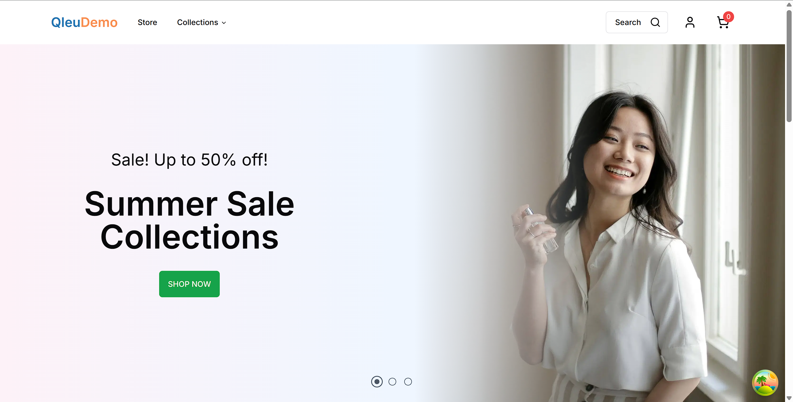
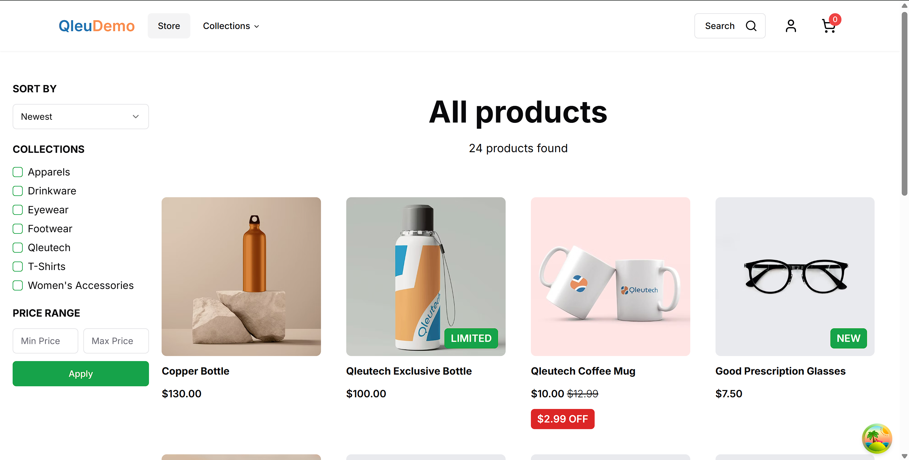

# QleuDemo Store - E-Commerce Platform

A full-stack e-commerce application built with **Next.js 15**, **React 19**, **TypeScript**, and the **Wix API** for headless e-commerce management. Built for fun and also for learning purpose.
[https://qleudemostore.netlify.app/](https://qleudemostore.netlify.app/)




## 🚀 Features

### Core E-Commerce Functionality
- **Product Catalog**: Browse featured and filtered products with detailed views
- **Product Search**: Full-text search with Fuse.js integration for instant results
- **Shopping Cart**: Add/remove items, manage quantities, with persistent state
- **Collections**: Organize products by categories and collections
- **Product Details**: High-quality product images with zoom capability, pricing, and options
- **Back-in-Stock Notifications**: Subscribe to notifications for unavailable products

### User Authentication & Profiles
- **Google OAuth Login**: Seamless authentication with Google Sign-In
- **Email/Password Authentication**: Traditional signup and login with email verification
- **Member Profiles**: View and update customer contact information
- **Password Recovery**: Forgot password flow with verification codes

### Reviews & Ratings
- **Product Reviews**: Create and view customer reviews with ratings
- **Media Attachments**: Upload images with reviews
- **Review Statistics**: Display average ratings and review counts
- **User-Generated Content**: Enhance trust and social proof

### UI & UX
- **Responsive Design**: Mobile-first design with Tailwind CSS
- **Dark Mode Support**: Theme switching with next-themes
- **Accessible Components**: Built with Radix UI primitives
- **Loading States**: Skeleton screens and loading indicators
- **Toast Notifications**: User feedback for actions and errors
- **Mobile Navigation**: Optimized mobile menu and search

### Technical Highlights
- **Server-Side Rendering (SSR)**: Fast initial page loads
- **API Routes**: Custom backend endpoints for auth, media, and more
- **Type Safety**: Full TypeScript support
- **State Management**: React Query for server state management
- **Form Validation**: Zod schemas with React Hook Form
- **Error Handling**: Custom application error handling

## 🛠️ Tech Stack

| Layer | Technology |
|-------|-----------|
| **Frontend Framework** | Next.js 15, React 19 |
| **Language** | TypeScript |
| **Styling** | Tailwind CSS, CSS Modules |
| **UI Components** | Radix UI, Shadcn/ui |
| **Forms** | React Hook Form, Zod |
| **State Management** | React Query (TanStack Query) |
| **E-Commerce Backend** | Wix API (SDK) |
| **Authentication** | Google OAuth, Custom Email Auth |
| **Image Handling** | Wix Media API, react-medium-image-zoom |
| **HTTP Client** | Axios, Ky |
| **Animations** | Framer Motion |
| **Date Handling** | date-fns |
| **Charts** | Recharts |
| **Search** | Fuse.js |
| **Security** | react-google-recaptcha-enterprise |
| **Code Quality** | ESLint, Prettier |

## 📁 Project Structure

```
src/
├── app/                          # Next.js app directory
│   ├── (auth)/                   # Authentication routes
│   │   ├── login/               # Login page and form
│   │   ├── signup/              # Registration page
│   │   ├── forgot-password/     # Password recovery
│   │   └── verification/        # Email verification
│   ├── (main)/                   # Main application routes
│   │   ├── store/               # Product store/listing
│   │   ├── products/            # Product details pages
│   │   └── collections/         # Category browsing
│   ├── profile/                  # User profile management
│   ├── api/                      # API routes
│   │   ├── auth/                # Authentication endpoints
│   │   └── media/               # Media upload endpoints
│   └── layout.tsx               # Root layout component
├── components/                   # Reusable React components
│   ├── navbar/                  # Navigation components
│   ├── review/                  # Review-related components
│   ├── ui/                      # UI primitives (Shadcn/ui)
│   └── *                        # Feature components
├── hooks/                        # Custom React hooks
│   ├── use-cart.ts              # Shopping cart management
│   ├── use-login-success.ts     # Auth success handling
│   ├── use-create-review.ts     # Review creation
│   └── *                        # Other custom hooks
├── lib/                          # Utility functions and helpers
│   ├── wix-client.*.ts          # Wix SDK initialization
│   ├── applicationError.ts      # Error handling
│   └── utils.ts                 # Helper utilities
└── wix-api/                      # Wix API integration layer
    ├── products.ts              # Product queries
    ├── collections.ts           # Collection management
    ├── cart.ts                  # Cart operations
    ├── members.ts               # Member/user operations
    ├── auth.ts                  # Authentication
    ├── reviews.ts               # Review management
    └── *                        # Other API modules
```

## ⚙️ Installation & Setup

### Prerequisites
- **Node.js**: 18.x or higher
- **npm** or **yarn** or **pnpm**
- **Wix Account**: With API credentials configured

### Steps

1. **Clone the repository**
   ```bash
   git clone <repository-url>
   cd ecom-wix-demo
   ```

2. **Install dependencies**
   ```bash
   npm install
   ```

3. **Configure environment variables**
   Create a `.env.local` file in the root directory:
   ```env
   # Wix API Configuration
   NEXT_PUBLIC_WIX_CLIENT_ID=your_wix_client_id
   WIX_API_KEY=your_wix_api_key
   
   # Google OAuth
   NEXT_PUBLIC_GOOGLE_CLIENT_ID=your_google_client_id
   
   # reCAPTCHA
   NEXT_PUBLIC_RECAPTCHA_SITE_KEY=your_recaptcha_key
   RECAPTCHA_SECRET_KEY=your_recaptcha_secret
   ```

4. **Run the development server**
   ```bash
   npm run dev
   ```

5. **Open in browser**
   Navigate to [http://localhost:3000](http://localhost:3000)

## 📚 Available Scripts

```bash
# Development server with hot reload
npm run dev

# Build for production
npm run build

# Start production server
npm start

# Run linting
npm run lint
```

## 🔑 Key Components Overview

### Authentication System
- Google OAuth integration via `@react-oauth/google`
- Email/password authentication with verification codes
- Protected routes and role-based access
- Session management with cookies

### Shopping Cart
- Real-time cart updates with React Query
- Persistent cart state
- Add/remove/update product quantities
- Integration with Wix Cart API

### Product Catalog
- Server-side fetching for SEO optimization
- Dynamic product pages with `[slug]` routing
- Product filtering and sorting
- Image optimization with Wix Media API

### Review System
- Create reviews with ratings (1-5 stars)
- Upload review media/images
- Display aggregate review statistics
- User-generated content management

### Search Functionality
- Client-side full-text search with Fuse.js
- Real-time search results
- SearchBar component in navigation

## 🎨 Styling & Theme

- **Tailwind CSS**: Utility-first CSS framework
- **Dark Mode**: Automatic system preference detection with next-themes
- **Radix UI**: Accessible component primitives
- **Custom Components**: Shadcn/ui components extended with Tailwind

## 🚀 Deployment

### Deploy on Vercel (Recommended)

The easiest way to deploy is using [Vercel](https://vercel.com):

1. Push your code to GitHub/GitLab/Bitbucket
2. Connect your repository to Vercel
3. Set environment variables in Vercel dashboard
4. Deploy with a single click

[Learn more about Next.js deployment](https://nextjs.org/docs/deployment)

### Other Deployment Options
- Docker containerization
- Self-hosted on VPS (AWS, DigitalOcean, etc.)
- Netlify
- Railway

## 📖 Documentation

- [Next.js Documentation](https://nextjs.org/docs)
- [Wix Ecom API](https://www.wix.com/developers/api)
- [React Query Documentation](https://tanstack.com/query/latest)
- [Tailwind CSS](https://tailwindcss.com)
- [Shadcn/ui Components](https://ui.shadcn.com)

---

